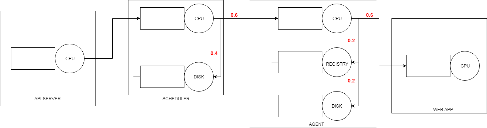

## Miniteste de validação

### Comparação dos resultados

[Comparação dos resultados](https://docs.google.com/document/d/1L386pjLXu1KC0mAsms5fDAQgW20onjaR-Jiy4CBoBFw/edit#)

### Execução no Arena

[Arquivo do arena](projeto_simulacao.doe)

* Baixa utilização: 2 repetições de 500 segundos.  [Relatório geral](report_lowrate.pdf)

* Alta utilização: 5 repetições de 500 segundos.  [Relatório geral](report_highrate.pdf)

### Análise teórica

[Planilha](https://docs.google.com/spreadsheets/d/1ZmRYxkXmG74FZBsFx6xnZJOvY4t3V_lr-qTiaq1yWkY/edit#gid=0)
